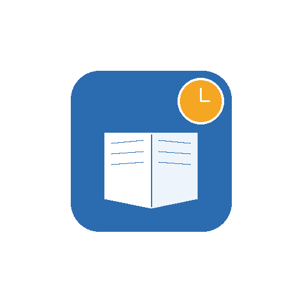

<p align="center">
  
</p>

<h1 align="center">Study Tracker</h1>

<p align="center">
  A lightweight Windows tray app that opens your study tracker PDF in Microsoft Edge on a schedule — so logging your progress never depends on remembering to do it.
</p>

<p align="center">
  
  
  
</p>

---

## Why

Trackers only work if you actually open them. Study Tracker removes that friction: pick a PDF once, set an interval, and it pops open in Edge on schedule so you can log progress and get back to work.

## Features

| | |
|---|---|
| ⏱ **Scheduled auto-open** | Opens your tracker PDF in Microsoft Edge every N hours |
| 🎯 **Flexible first reminder** | Start now, at the next clean hour (10:00, 12:00...), or a custom time |
| 🗂 **System tray integration** | Minimizes to the tray; right-click for Show, Open now, Pause/Resume, Exit |
| 🧹 **No tab pile-up** | Closes the previous Edge window before opening the next |
| 💾 **Persistent settings** | Your PDF path and interval are remembered between launches |
| ⏳ **Live countdown** | See exactly how long until the next reminder |

## Requirements

- Windows 10/11
- Microsoft Edge installed at its default location
- Python 3.9+ (only needed if running from source)

## Installation

### Run from source

```bash
git clone https://github.com/<your-username>/study-tracker.git
cd study-tracker
pip install -r requirements.txt
pythonw tracker.pyw
```

`pythonw` runs the app without a console window.

### Build a standalone .exe

```bash
pip install pyinstaller
python -m PyInstaller --onefile --windowed --icon=icon.ico --add-data "icon.ico;." --name "StudyTracker" tracker.pyw
```

The finished executable will be in `dist/StudyTracker.exe`. Pin it to your taskbar for one-click access.

## Usage

1. Launch the app.
2. Click **Select Tracker PDF** and choose your tracker file.
3. Set the reminder interval in hours.
4. Choose when the first reminder should fire — now, the next clean hour, or a custom time.
5. Click **START**.
6. The app opens your PDF in Edge on schedule. Close the Edge window when you're done for now — it reopens automatically at the next interval.
7. Closing the app window minimizes it to the tray. Right-click the tray icon to pause, resume, open the PDF immediately, or exit.

## Project structure

```
study-tracker/
├── tracker.pyw          # Application source
├── icon.ico             # App icon (window + built exe)
├── assets/              # Images used in this README
├── requirements.txt     # Python dependencies
└── README.md
```

`tracker_config.json` is created automatically next to the app on first run to store your chosen PDF path and interval. It's excluded from version control since it's user-specific.

## How it works

Built with Tkinter for the UI and `tkinter.after()` for scheduling, so no external scheduler or admin rights are needed. A system tray icon (via `pystray`) keeps it running quietly in the background. When a reminder fires, the app launches Microsoft Edge directly via `subprocess`, pointed at the selected PDF, and terminates the previously spawned Edge process to avoid accumulating windows over long sessions.

## License

MIT — feel free to fork, modify, and adapt for your own workflow.
